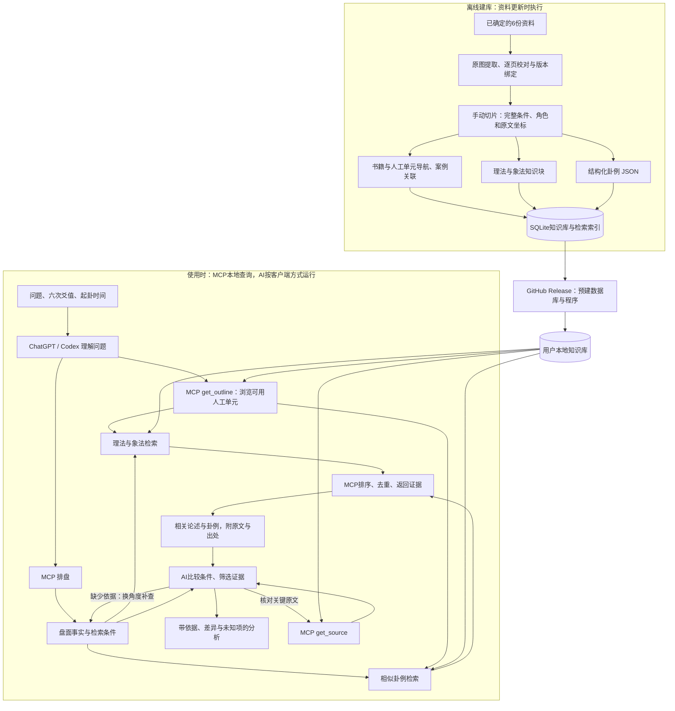

# 六爻助手 · Codex 插件与本地 MCP

让你正在使用的 AI 按资料检索六爻理法、象法和卦例，并提供可回查的出处。程序负责排盘和查库，AI 负责理解问题、筛选资料和组织分析。

- **预建数据库**：六份资料，保留原文、校订记录、盘面核对状态与出处；实际数量以随包发行清单为准。
- **使用RAG查询卦理**：AI结合问题、盘面和已有证据，从多个角度按需检索、补查与去重。
- **本地排盘与检索**：下载完成后离线运行，无需额外模型或API Key；接入端AI按其原有方式运行。
- **可直接展示的排盘**：本变卦并排，包含六神、伏神、纳甲六亲、动爻、世应、干支与农历。
- **手动规则与场景检索**：原文绑定页、行、列及哈希；共享条件随规则返回，书籍和人工单元可以导航回查。
- **支持多 Harness**：标准 MCP + 同一份 `SKILL.md`，`python install/install.py` 一键接入 Codex、Claude Code、Cursor、Gemini CLI、Cline、Roo、OpenCode、Cherry Studio、Trae、Qoder、CodeBuddy、WorkBuddy、CodeWiz、TClaude、TCodex、OpenClaw、Hermes、ZCode，见[支持多 Harness](#支持多-harness)。

## 使用正式版

固定版本 wheel 包含程序与手切数据库，首次下载后可以离线运行：

```powershell
uvx --python 3.11 --from https://github.com/zhishengyk/liuyao/releases/download/v0.8.2/liuyao_mcp-0.8.2-py3-none-any.whl liuyao-mcp --self-check
```

缓存准备完成后，完全离线启动需在 `uvx` 后显式加 `--offline`。默认启动器可能联网核验包缓存，不能保证在任意断网环境中直接启动；SQLite检索本身在本地执行。

MCP客户端使用同一条命令去掉 `--self-check`，选择STDIO传输。插件ZIP中的配置也固定到此版本。正式发行包附带Windows安装脚本。下面的Git插件目录跟随main，当前同样指向0.8.2。

## 安装跟随 main 的 Codex 插件

需要可用的 **Codex CLI** 和 **uv**。先按[uv官方说明](https://docs.astral.sh/uv/getting-started/installation/)安装uv，在新终端确认 `codex --version`、`uvx --version` 能运行。

**Windows推荐入口**：从[最新Release](https://github.com/zhishengyk/liuyao/releases/latest)下载 `install.ps1`，在下载目录执行：

```powershell
powershell -ExecutionPolicy Bypass -File .\install.ps1
```

该脚本会注册或刷新main上的GitHub插件目录，再按目录中的配置下载预建包并完成离线自检。因此，即使脚本来自最新稳定Release，安装的程序版本仍由当前main决定。**不需要克隆源码仓库、手工修改JSON或重新建库。** 安装后由Codex更新插件，新版程序与数据库在首次启动时自动下载，日常复用缓存，无需为每次升级重新运行脚本。

也可以直接安装跟随main的插件：

```powershell
codex plugin marketplace add zhishengyk/liuyao --ref main --sparse .agents/plugins --sparse plugins/liuyao-assistant
codex plugin add liuyao-assistant@liuyao
```

在桌面端插件页或Codex CLI的 `/plugins` 中确认“六爻助手”已启用，然后**开启新会话**。如果装过 `liuyao-assistant@personal` 开发版，选择一个来源使用，避免重复入口。安装状态可用 `codex plugin list --json` 查看。

> 按当前[OpenAI插件文档](https://learn.chatgpt.com/docs/plugins)，IDE扩展不支持插件包。VS Code Codex使用下面的直接MCP入口；桌面端/CLI使用插件入口。

### VS Code 或其他 MCP 客户端

手动方式仍然可用，也适用于[支持多 Harness](#支持多-harness) 列出的任何客户端。下面的直接MCP入口固定版本，不随main切换版本。注册本地服务：

```powershell
codex mcp add liuyao -- uvx --python 3.11 --from https://github.com/zhishengyk/liuyao/releases/download/v0.8.2/liuyao_mcp-0.8.2-py3-none-any.whl liuyao-mcp
```

其他客户端使用相同的 `uvx` 命令和参数，传输选择STDIO。已有开发配置时，清除旧的 `LIUYAO_ROOT`、`LIUYAO_DB` 和仓库 `cwd`。首次下载可以先在终端完成，避免客户端启动超时；MCP初始化说明已包含使用流程，独立Skill可按需安装。

## 支持多 Harness

六爻助手以标准 MCP 提供排盘、理法与象法检索、相似卦例和原文回查，可直接接入以下 Harness / AI 客户端：

- **Codex**：原生插件市场安装（本仓库 `.agents/plugins`），自动更新
- **Claude Code、Cursor、Gemini CLI、Cline、Roo Code、OpenCode**：自动注册 MCP 并复制使用技能（SKILL.md）
- **Cherry Studio、Trae、Qoder、CodeBuddy、WorkBuddy、CodeWiz、TClaude、TCodex、OpenClaw、Hermes、ZCode**：导入同一份配置或执行注册命令

安装层只有两个源文件——[install/liuyao.mcp.json](install/liuyao.mcp.json)（标准 mcpServers 配置）和同一份 `SKILL.md`；脚本自动检测并注册本机已安装的 Harness：

```powershell
python install/install.py            # 一键安装（自动检测并注册）
python install/install.py --list     # 查看本机检测结果
python install/install.py --remove   # 卸载
```

其他参数（`--workspace` 项目级写入、`--clients` 指定客户端、`--dry-run` 预览、`--print-json` 打印配置、`--update` 升级版本）见 `python install/install.py --help`。

要点：

- 需要已安装 `uvx`（[uv 官方安装](https://docs.astral.sh/uv/getting-started/installation/)）。
- 合并只写入/更新 `liuyao` 条目，**保留该文件已有的其他 MCP 服务器**；首次写入前自动留 `.liuyao-bak` 备份。
- 注册后重启客户端并开启新会话；首次连接自动下载发行版（预留180秒），之后离线可用。
- 手动兜底：任何客户端粘贴同一条命令（传输选STDIO）：

```powershell
uvx --python 3.11 --from https://github.com/zhishengyk/liuyao/releases/download/v0.8.2/liuyao_mcp-0.8.2-py3-none-any.whl liuyao-mcp
```

## 怎样提问与起卦

**如果你不熟悉如何起卦，请阅读[如何起卦](docs/如何起卦.md)，了解摇卦方法、记录示例与注意事项。**

先明确一个问题和时间范围。用三枚相同硬币，固定约定**字面=0，背面=1**，连续摇六次；每次背面个数就是爻值，按先后顺序记为初爻到上爻。输入、排盘计算和卦例JSON统一使用0/1/2/3。

| 每次结果 | 爻值 | 含义 |
| --- | --- | --- |
| 三字 | 0 | 老阴，阴变阳，× |
| 一背两字 | 1 | 少阳，静爻 |
| 两背一字 | 2 | 少阴，静爻 |
| 三背 | 3 | 老阳，阳变阴，○ |

记录起卦时刻和时区，可以按下面格式发送作为参考：

```text
使用六爻助手。
占问：当前项目未来三个月的发展如何？
起卦时间：2026-09-05 01:27，北京时间。
六次背面数（初爻→上爻）：0 1 2 2 1 3。
请展示本变卦排盘，结合问题和盘面从多个角度检索理法与卦例，
比较适用条件，根据已有证据按需调整检索参数、补充查询，并回查关键原文。
```

已有排盘软件时，直接提供六个爻值、动爻、日期或清晰截图；看不清的信息需补充。纯理论问题可以直接问“工作变动如何取用”，不需要起卦。详细步骤、不同记录方式与时区约定见[起卦与排盘指南](docs/起卦与排盘指南.md)。

## 排盘输出示例

下表由程序生成，使用参考截图对应的爻值`0 1 1 2 1 1`；占问使用通用示例。输入按初爻到上爻，显示按上爻到初爻。

**六爻排盘**

占问：当前项目的前景如何？

时间：2026-09-05T01:27:00+08:00　星期六（二〇二六年七月廿四）

干支：丙午年　丙申月　壬午日　辛丑时（旬空：申、酉）

参考神煞：羊刃—子　驿马—申　咸池—卯

| 爻位 | 六神 | 伏神 | 本卦：巽为风（巽宫·六冲） | 动爻 | 变卦：风天小畜（巽宫） |
| --- | --- | --- | --- | --- | --- |
| 上爻 | 白虎 | — | `兄弟辛卯木 ━━━━━━━ 世` | — | `兄弟辛卯木 ━━━━━━━` |
| 五爻 | 螣蛇 | — | `子孙辛巳火 ━━━━━━━` | — | `子孙辛巳火 ━━━━━━━` |
| 四爻 | 勾陈 | — | `妻财辛未土 ━━━　━━━` | — | `妻财辛未土 ━━━　━━━ 应` |
| 三爻 | 朱雀 | — | `官鬼辛酉金 ━━━━━━━ 应` | — | `妻财甲辰土 ━━━━━━━` |
| 二爻 | 青龙 | — | `父母辛亥水 ━━━━━━━` | — | `兄弟甲寅木 ━━━━━━━` |
| 初爻 | 玄武 | — | `妻财辛丑土 ━━━　━━━` | × → | `父母甲子水 ━━━━━━━ 世` |

×：老阴变阳；○：老阳变阴。输入爻值从初爻到上爻，表格从上爻到初爻展示。

变卦六亲沿用本卦宫五行，变卦世应按其自身八宫位置标注。神煞不代替取用与理法判断。

排盘工具返回结构化JSON及 `display.markdown`；AI可以直接展示表格，不必重新计算或手写纳甲。

查明取用依据后，AI可分别选择显爻、同位伏神或实际动爻所化的变爻，使用各自的旬空与日月关系核查组合条件；相似卦例也保留不同层的候选。详见[取用与排盘指南](docs/起卦与排盘指南.md#显爻伏神和变爻取用)。

## 资料如何进入分析

检索条件和资料字段修复不等于预测准确率提升。0.6.4的8例成对试验没有观察到检索带来主方向增益，结果及边界见[完整评测记录](docs/评测结果-0.6.4.md)；这些冻结预测不覆盖0.6.5新增的分层用神接口。



图中的检索包括两路：论述回答“应参考哪些规则”，卦例回答“有哪些可比较的盘面与解释”。AI结合占问、六亲、世应、动爻、空破及已找到的证据，选择查询角度，并按需要调整返回数量、过滤条件和补查范围。读取候选后再判断适用性；相同卦名、相同结论或较高检索分数都不等于可直接照搬。新卦仅作为查询，不自动写入历史案例库。

检索数量由AI每次主动选择：简单问题少量起查，复杂问题或证据有分歧时扩查，并排除已读条目。论述和卦例没有固定配额；关键判断有适用原文支持、重要分歧已核对后停止，资料不足则明确说明。

手切库的 `get_outline` 浏览当前已有的书籍与人工单元；标签不冒充原书章题。`search_knowledge(method="xiangfa")`按场景查询，`outline_ids`限定已返回的节点；`get_source`回查完整原文及 `required_contexts`。旧版PDF目录文档仍可参考，但其旧ID和行号不能替代新库坐标。

相似案例只按原问、事前背景和已知盘面检索，生产 MCP 也只返回这些事前材料及机械盘面字段。作者断语、事后反馈、结局和复盘保留在内部数据库供隔离评测使用，不通过生产接口读取。预测所需方法应优先使用 `kind="rule"` 并用 `get_source` 回查规则原文。


## 开发与验证

断卦提示词只包含七步预测流程、领域入口和按需核对的规则证据 ID。技能先锁定原问和核盘，在最终判向前加载当前领域入口，再通过 `kind="rule"` 读取所需原文及例外；不会把整本领域原文或历史例证自动装入上下文。

执行 `python scripts/build_skill_prompts.py` 可生成 `plugins/liuyao-assistant/skills/interpret-liuyao/references/source-prompts/`。Git保存生成程序和 `scripts/skill_prompt_plan.json` 唯一真源；生成物随插件 ZIP 和 wheel 发行。`get_source` 可通过 `prompt:GLOBAL.md`、`prompt:study/PROMPT.md` 等固定入口读取同版流程。数据库版本或文件校验不一致会明确报错。

```powershell
python -m venv .venv
.\.venv\Scripts\python.exe -m pip install -e ".[test]" build uv
.\.venv\Scripts\python.exe scripts/prepare_corpus.py
.\.venv\Scripts\python.exe -m liuyao_mcp.ingest
.\.venv\Scripts\python.exe -m pytest -q
.\.venv\Scripts\python.exe scripts/build_release.py
```

Git保留代码和小型[语料版本清单](data/corpus.lock.json)。`prepare_corpus.py` 从Release下载所需语料包，核对SHA-256后恢复到本地；六书重建包约12.3MB，普通插件用户不需要下载它。完整资料和历史审计归档另约45MB，需要时加 `--include-reference`。恢复脚本不会覆盖已修改的本地语料。

默认安装不下载推理模型。恢复后的手切清单已绑定对应审计，可以直接入库；修改切片后先运行 `scripts/assemble_manual_slices.py`，再按审计文件用 `scripts/attach_chart_audits.py` 重新绑定盘面证明。未绑定记录保持not_run。稳定构建默认要求全书覆盖，预发布必须显式使用 `--prerelease`。CI要求完整测试套件和隔离安装检查通过，并保留完整测试报告；预发布也不能跳过未预期的失败。已知的无筛选求职排序缺口显式标为xfail，不计作通过。

反馈审核分批保存在 `data/manual_slices/quality_reviews/shards/`；运行 `scripts/assemble_quality_reviews.py` 合并，既有独立审核会保留为种子。审核与盘面证明合并后再重建 SQLite。发布新语料使用 `scripts/package_corpus.py --output <压缩包路径>`：它按文件系统清单打包并核对切片哈希，不依赖 Git 跟踪状态，排除草稿、生成数据库与模型缓存。语料 ZIP 上传 Release，Git 仅更新小型版本清单。

## 资料与边界

首批资料为《六爻预测自修宝典》《王虎应增删卜易评释》《增删卜易》《六爻理法进阶》《六爻象法进阶》上、下，共六份文件。来源、手切边界与审核证据保存在[版本化语料包](https://github.com/zhishengyk/liuyao/releases/download/corpus-2026-09-12/liuyao-corpus-2026-09-12-r3.zip)中。原Word未能取得的缺损保留未知；整页入库不等于全页已切片或每盘已核对。历史反馈是原作者记载，不等于独立验证或未来预测保证。

原始资料共1,862个Markdown文件；六份建库来源随语料包提供，其余保存在[资料及审计归档](https://github.com/zhishengyk/liuyao/releases/download/v0.7.0-alpha.1/liuyao-reference-archive-2026-09-11.zip)。同时恢复两个压缩包即可恢复原目录结构。原始Word、图片、音频和转换附件未上传；旧文档中的本地图片链接可能无法显示。
