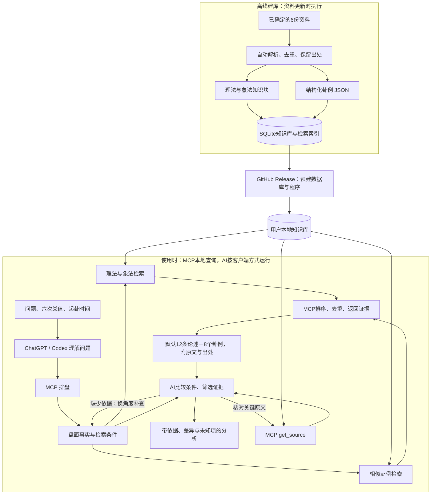

# 六爻助手 · Codex 插件与本地 MCP

让你正在使用的 AI 按资料检索六爻理法、象法和卦例，并提供可回查的出处。程序负责排盘和查库，AI 负责理解问题、筛选资料和组织分析。

- **预建数据库**：六份资料，2,139个知识块、1,548条候选卦例，保留出处与OCR问题。
- **使用rag查询卦理**：支持扩大数量、换问法补查和按ID去重。
- **本地排盘与检索**：下载完成后离线运行，无需额外模型或API Key；接入端AI按其原有方式运行。
- **可直接展示的排盘**：本变卦并排，包含六神、伏神、纳甲六亲、动爻、世应、干支与农历。

当前正式功能是中文BM25＋六爻结构匹配，候选语义筛选交给宿主AI。SQLite向量组件已实现并测试，但全库语义编码与神经reranker仍是实验，默认安装不会下载BGE模型。

## 安装到 Codex

需要可用的 **Codex CLI** 和 **uv**。先按[uv官方说明](https://docs.astral.sh/uv/getting-started/installation/)安装uv，在新终端确认 `codex --version`、`uvx --version` 能运行。

**Windows推荐入口**：从[最新Release](https://github.com/zhishengyk/liuyao/releases/latest)下载 `install.ps1`，在下载目录执行：

```powershell
powershell -ExecutionPolicy Bypass -File .\install.ps1
```

它会注册或刷新GitHub插件目录，读取其中固定的程序版本，下载对应预建包，完成离线自检，再安装插件。**不需要克隆源码仓库、手工修改JSON或重新建库。** 日常启动使用已缓存版本；更新时再次运行此脚本。

也可以手动安装本版：

```powershell
uvx --python 3.11 --from https://github.com/zhishengyk/liuyao/releases/download/v0.3.0/liuyao-mcp.tar.gz liuyao-mcp --self-check
codex plugin marketplace add zhishengyk/liuyao --ref main --sparse .agents/plugins --sparse plugins/liuyao-assistant
codex plugin add liuyao-assistant@liuyao
```

在桌面端插件页或Codex CLI的 `/plugins` 中确认“六爻助手”已启用，然后**开启新会话**。如果装过 `liuyao-assistant@personal` 开发版，选择一个来源使用，避免重复入口。安装状态可用 `codex plugin list --json` 查看。

> 按当前[OpenAI插件文档](https://learn.chatgpt.com/docs/plugins)，IDE扩展不支持插件包。VS Code Codex使用下面的直接MCP入口；桌面端/CLI使用插件入口。

### VS Code 或其他 MCP 客户端

先运行上述uvx准备命令，再注册本地服务：

```powershell
codex mcp add liuyao -- uvx --offline --python 3.11 --from https://github.com/zhishengyk/liuyao/releases/download/v0.3.0/liuyao-mcp.tar.gz liuyao-mcp
```

其他客户端使用相同的 `uvx` 命令和参数，传输选择STDIO。已有开发配置时，清除旧的 `LIUYAO_ROOT`、`LIUYAO_DB` 和仓库 `cwd`。首次下载可以先在终端完成，避免客户端启动超时；MCP初始化说明已包含使用流程，独立Skill可按需安装。

## 怎样提问与起卦

先明确一个问题和时间范围。用三枚相同硬币，固定约定**字面=0，背面=1**，连续摇六次；每次三枚数值相加，按先后顺序记为初爻到上爻。

| 每次结果 | 爻值 | 含义 |
| --- | --- | --- |
| 三字 | 0 | 老阴，阴变阳，× |
| 一背两字 | 1 | 少阳，静爻 |
| 两背一字 | 2 | 少阴，静爻 |
| 三背 | 3 | 老阳，阳变阴，○ |

记录起卦时刻和时区，按下面格式发送：

```text
使用六爻助手。
占问：当前项目未来三个月的发展如何？
起卦时间：2026-09-05 01:27，北京时间。
六次爻值（初爻→上爻）：6、7、7、8、7、7。
请展示本变卦排盘，再查12条相关论述和8个卦例，
比较适用条件，必要时补查，并回查关键原文。
```

已有排盘软件时，直接提供六个爻值、动爻、日期或清晰截图；看不清的信息需补充。纯理论问题可以直接问“工作变动如何取用”，不需要起卦。详细步骤、不同记录方式与时区约定见[起卦与排盘指南](docs/起卦与排盘指南.md)。

## 排盘输出示例

下表由程序生成，排布参考用户提供的六爻排盘截图；占问使用通用示例。输入按初爻到上爻，显示按上爻到初爻。

**六爻排盘**

占问：当前项目的前景如何？

时间：2026-09-05T01:27:00+08:00　星期六（二〇二六年七月廿四）

干支：丙午年　丙申月　壬午日　辛丑时（旬空：申、酉）

参考神煞：羊刃—子　驿马—申　咸池—卯

| 爻位 | 六神 | 伏神 | 本卦：巽为风（巽宫·六冲） | 动爻 | 变卦：风天小畜（巽宫） |
| --- | --- | --- | --- | --- | --- |
| 上爻 | 白虎 | — | `兄弟辛卯木 ━━━━━━━ 世` | — | `兄弟辛卯木 ━━━━━━━` |
| 五爻 | 螣蛇 | — | `子孙辛巳火 ━━━━━━━` | — | `子孙辛巳火 ━━━━━━━` |
| 四爻 | 勾陈 | — | `妻财辛未土 ━━━　━━━` | — | `妻财辛未土 ━━━　━━━ 应` |
| 三爻 | 朱雀 | — | `官鬼辛酉金 ━━━━━━━ 应` | — | `妻财甲辰土 ━━━━━━━` |
| 二爻 | 青龙 | — | `父母辛亥水 ━━━━━━━` | — | `兄弟甲寅木 ━━━━━━━` |
| 初爻 | 玄武 | — | `妻财辛丑土 ━━━　━━━` | × → | `父母甲子水 ━━━━━━━ 世` |

×：老阴变阳；○：老阳变阴。输入爻值从初爻到上爻，表格从上爻到初爻展示。

变卦六亲沿用本卦宫五行，变卦世应按其自身八宫位置标注。神煞不代替取用与理法判断。

排盘工具返回结构化JSON及 `display.markdown`；AI可以直接展示表格，不必重新计算或手写纳甲。

## 资料如何进入分析



图中的检索包括两路：论述回答“应参考哪些规则”，卦例回答“有哪些可比较的盘面与解释”。AI读取候选后再判断适用性；相同卦名、相同结论或较高检索分数都不等于可直接照搬。新卦仅作为查询，不自动写入历史案例库。

## 更新

Windows再次运行 `install.ps1`，会按GitHub插件目录准备对应新版本并重新安装，完成后开新会话。

手动更新时，先执行 `codex plugin marketplace upgrade liuyao`，再准备更新后的插件配置中指定的服务包，最后执行 `codex plugin add liuyao-assistant@liuyao`。目录刷新、程序准备和插件安装是配套步骤。**当前没有常驻更新器，也不保证GitHub推送后客户端立即自动更新。** 断网时已安装版本仍可用；清理uv缓存后需重新准备。

[插件安装与分发](docs/Codex插件接入与分发.md) · [发布与版本管理](docs/发布与版本管理.md)

## 开发与验证

```powershell
powershell -ExecutionPolicy Bypass -File scripts/install.ps1
.\.venv\Scripts\python.exe -m pytest -q
.\.venv\Scripts\python.exe -m liuyao_mcp.evaluate
.\.venv\Scripts\python.exe scripts/build_release.py
```

默认源码安装不下载推理模型。`-InstallPlugin`安装本机开发版；`-RegisterMcp`注册开发MCP。向量相关代码与依赖单独保留，实验边界见[实施验收](docs/实施验收.md)。

## 资料与边界

首批资料为《六爻预测自修宝典》《王虎应增删卜易评释》《增删卜易》《六爻理法进阶》《六爻象法进阶》上、下，共六份文件，清单及哈希见[data/sources.jsonl](data/sources.jsonl)。候选卦例可能存在OCR错误、字段缺失和原书排盘冲突，工具会保留问题，不把候选数量当作已核验数量。历史反馈是原作者的记载，不等于独立验证或未来预测保证。

原始资料归档包含1,862个Markdown文件，保留原目录结构：[资料目录](Markdown归档/README.md)。原始文档、图片、音频和转换附件未上传；旧文档中的本地图片链接可能无法在GitHub显示。
