**六爻 MCP 落地方案**

日期：2026-09-09。本文保留系统设计与开发过程中的取舍；当前0.6.0安装、起卦和使用方式以[README](../README.md)为准，实际完成情况见[实施验收](实施验收.md)。GitHub插件安装/更新入口已提供，独立神经检索仍属实验。

目标：交付一个可接入 ChatGPT 桌面端和 VS Code 内 Codex 扩展的“六爻助手”。底层通过 MCP 提供准确的排盘数据、可追溯的六爻理法和相似卦例，由接入端 AI 根据证据完成分析。

**知识组织现状（2026-09-10）：** 0.6.0已接入理法与卦例的14个大类、62个小类，支持父类回退、公共理法和未分类候补；自动标注保留依据，不视为人工金标。象法继续采用0.5.0的原书目录、实际场景和关键爻线索。格局计算返回盘面前提和书籍出处，具体事件仍需结合取用、旺衰与场景。详见[分类与格局实现说明](分类与格局实现说明.md)和[象法目录与场景索引方案](象法目录与场景索引方案.md)。

第一版交付包含本地 MCP 服务、安装配置和薄插件包：四个工具提供能力，插件内的使用指引帮助 AI 按理法调用。用户安装或配置一次，之后在已有 AI 客户端里直接提问。按用户确认的 6 份现有文件自动处理完整正文，不设置人工检索、逐条挑选或人工标注的前置流程。预计 1 名开发者用 2–3 周完成首版；OCR 结构解析和客户端联调是主要不确定项。

**最新发布约束（2026-09-09，用户确认）：下载预建数据库后，本 MCP 的排盘和检索离线运行；用户不需要重新切片、编码资料或安装 BGE 大模型。** 建库与使用分开：开发端处理六份资料并发布数据库，用户端通过 stdio 查询本地数据。用户已接受简化Windows安装步骤，并要求支持自动更新。现已核对本机Codex CLI 0.153.0对应源码，原生启动任务可自动更新Git插件目录和已安装插件缓存，项目复用该能力，不再开发自定义更新器。0.4.1改用固定版本wheel，uvx首次自动下载程序、预建数据库及依赖，之后复用缓存。发布时先推标签并验证实际Release下载，成功后才推main，让原生插件更新取得可用的版本；用户升级无需重跑安装脚本。已缓存且配置仍指向该版本时可离线使用；配置更新到未缓存版本时，当前不支持自动回退。具体安装与更新限制见[插件安装与分发](Codex插件接入与分发.md)。接入端 AI 的运行方式由客户端决定。

SQLite 可加载 `sqlite-vec` 做向量检索，不需要迁移到 PostgreSQL。需区分两步：资料向量可以预建随库发布；新问题的语义向量仍需兼容的编码器，不能从已存向量凭空得到。`sqlite-vec` 本身不附带这个模型，`sqlite-lembed` 等编码扩展也需要模型文件。[sqlite-vec 文档](https://alexgarcia.xyz/sqlite-vec/)、[sqlite-lembed 文档](https://github.com/asg017/sqlite-lembed)

当前无模型发布链路为中文 BM25＋术语归一化＋卦象结构匹配。用户提出的向量召回与重排要求仍未完成，不因离线基础包可用就撤销验收。SQLite 向量检索可继续采用 sqlite-vec；待用户确认是否接受随包携带轻量查询编码器，再用匹配模型预建资料向量并验证融合检索。若用户明确选择完全不带编码模型，才将交付范围定为关键词与结构检索。BGE-M3/reranker 的大模型下载已暂停，不能把未完成实验或规则结构比较标成已交付语义召回。

**用户侧AI检索流程（已落实到插件指引）：** 用户在Codex中提出问题 → 当前AI根据原意生成术语和结构条件 → MCP从本地SQLite召回候选 → AI阅读、比较适用条件与盘面差异 → 必要时换角度补查并按ID去重 → 回查原文并形成分析。从0.4.2起，AI按复杂度、证据缺口和上下文预算每次主动选择limit，不固定论述／案例的条数或比例；关键判断有适用依据且分歧已核对时停止，连续补查无新增适用证据则说明不足。用户不需要额外配置API Key或本地模型；MCP不反向调用Codex，也不获取Codex内部embedding。该流程可由现有AI承担候选语义筛选，但不等于完成独立向量召回或神经reranker。插件skill与MCP初始化说明均提供指引，避免只装MCP时遗漏流程。[OpenAI MCP说明](https://learn.chatgpt.com/docs/extend/mcp?surface=cli)

更新方案进一步收敛为GitHub统一发布、Codex从Git插件目录同步和安装。优先复用原生命令，独立后台更新器暂不实施。自动同步的触发时机还需按实际客户端验证；GitHub发布成功不能代替用户电脑已拉取新版。具体步骤以[插件接入与分发](Codex插件接入与分发.md)的GitHub更新方案为准。

**一、当前实际起点**

已检查本地仓库 `C:/Users/duanshengxuan/liuyao`，分支 `main`，基线提交 `284bdc3cca8a0a8a2d9db915fda1898e557f8de3`，远端 `https://github.com/zhishengyk/liuyao.git`。检查开始时工作区干净。

- Git 跟踪 1,863 个文件，全部为 Markdown；其中归档 1,862 个，另有根 README。当前没有可复用的应用代码或排盘引擎。
- 根 README 明确说明：原始文档、图片、音频、JSON 校验数据和转换脚本未上传。归档内“完整性通过”的报告描述的是原本的完整资料环境，不能据此认定本工作区具备这些文件。
- 三本PDF原件现已由用户提供，811页机器对照完成；按用户确认的标准逐字对照原图分批校订，进度见[逐字台账](OCR逐字校对进度.md)。未知质量不补成虚构的高置信度，原图残缺明确记录。
- 抽查发现《增删卜易》和王虎应《增删卜易评释》正文后均有“原文逐段校核副本”。直接按全文切块，会把同一内容重复入库。
- 首批使用 3 份原生 Word 转出的材料，以及《六爻理法进阶》《六爻象法进阶》上、下册这 3 份 OCR 文本。用户已确认这里的《理法进阶》就是现有单份文件，不再寻找所谓 1、2 册。

证据：[根 README](../README.md)、[转换报告](../Markdown归档/_校验/转换完成报告.md)、[OCR 核对表](../Markdown归档/_校验/OCR重点核对页.md)。

**二、系统边界**

```mermaid
flowchart TD
    subgraph Build[离线建库：资料更新时执行]
        B0[已确定的6份资料] --> B1[自动解析、去重、保留出处]
        B1 --> B2[理法与象法知识块]
        B1 --> B3[结构化卦例 JSON]
        B2 --> K[(SQLite 知识库与检索索引)]
        B3 --> K
    end
    subgraph Runtime[本地使用：每次提问时执行]
        U[用户：问题、六次爻值、起卦时间] --> A[接入端 AI]
        A --> P[MCP 排盘工具]
        P --> Q[问题、盘面事实、检索条件]
        Q --> R[理法与象法检索]
        Q --> C[相似卦例检索]
        K --> R
        K --> C
        R --> E[分别排序、去重、补齐上下文]
        C --> E
        E --> F[默认12条相关论述与8个卦例]
        F --> A
        A --> S[MCP 原文回查与补充检索]
        S --> A
        A --> O[带原文依据的分析]
    end
```



MCP 服务负责计算和提供证据。接入端 AI 负责理解占问、选择用神、组织分析和表达结论。发布版排盘和检索均在本地执行，不调用生成模型、远程 embedding 或 reranker，不需要 API Key。开发端 BGE 实验单独启用，不是用户安装前提。

整体采用两路检索：一路寻找适用的理法、象法论述，另一路寻找盘面结构相似的卦例。两类数据共用来源登记与原文回查能力，分别召回和排序。SQLite 保存来源、知识块和案例；JSONL 用于案例检查与重建，向量索引在需要时作为派生数据增加。

离线建库只在资料或解析版本变化时执行。在线由 AI 先获得排盘事实并检索取用依据，再带着占类、关注爻位、空破和动变关系继续查找论述与案例；取用不确定时保留多个候选。AI 负责把两路工具结果合并到当前对话上下文，不需要另设一个生成式模型来组装答案。

必须区分三种信息：

| 信息 | 由谁产生 | 处理方式 |
| --- | --- | --- |
| 本变卦、动爻、纳甲、六亲、世应、日月干支、旬空、支冲关系 | 程序，依据声明的排盘约定 | 返回确定值与计算版本 |
| 用神选择、综合旺衰、合是否成化、应期取法 | 有出处的解释规则和 AI | 保留条件、作者及可能分歧 |
| 历史案例后续发生的事情 | 原书或原帖的结果记载 | 标明反馈来源和核验状态 |

明确的反馈文字只能证明“来源如此记载”；未经独立核验，不命名为 `verified`。规则实现一致、引文正确和现实预测有效是不同的验收问题。

**三、当前五个 MCP 工具**

| 工具 | 输入 | 返回 | 用途 |
| --- | --- | --- | --- |
| `build_chart` | 六个爻值，起卦时间；历史卦例也可直接传月支与日干支 | 结构化卦盘、客观关系、采用的历法约定 | 防止 AI 自行编排盘面 |
| `search_knowledge` | 查询文本，`kind=rule/case`，可选 `method=lifa/xiangfa/all`、占类、作者、盘面特征、`limit`、已返回的证据 ID | 论述默认 12 条、案例默认 8 个；数量可配置 | 分别寻找适用理法、象法与相似卦例，并支持补充检索 |
| `get_source` | `evidence_id`，可选扩大上下文范围 | 原文、邻接段落、版本、章节、定位 | 核对条件、例外和引用 |
| `get_topics` | 可选大类ID | 大类或其直接小类、证据数量 | 选择事项分支 |
| `get_outline` | 可选书籍、父节点及分页 | 原书目录节点、场景线索和相关案例 | 按象法原目录定位 |

`build_chart` 的输入约定：

- 六爻从初爻到上爻，即从下向上输入；统一用0=老阴、1=少阳、2=少阴、3=老阳，输入输出和存储采用同一套值。
- 时间输入须明确时区。第一版界面约定为北京时间、按节气确定月建、民用时间零点换日，不换算真太阳时；这些是本产品选择的口径，返回值要说明，不能当作所有流派唯一标准。
- 历史材料只有月支和日干支时，直接用原记载计算，不编造公历日期；同时提供两套日期信息时检查是否一致。
- 只有问题而没有起卦信息，接入端 AI 先补问。不能依据提问内容擅自生成一个卦，再声称这是用户的卦。
- 缺失、无法识别的原始爻值不能靠“修正后恰好能排盘”自动补齐。

`search_knowledge` 的返回设计：

```json
{
  "evidence_id": "rule_example_001",
  "kind": "rule",
  "work_id": "work_example",
  "edition_id": "edition_example",
  "author": "作者",
  "chapter": "章节路径",
  "quote": "从入库文本截取的原文",
  "source_path": "归档内相对路径",
  "source_span": {"start_line": 100, "end_line": 108},
  "source_hash": "入库原文的哈希",
  "review_status": "unreviewed",
  "matched_features": ["旬空"]
}
```

以上是接口示意，不是真实检索结果。原文由服务端直接截取，不能由模型重写。没有可靠页码的 Word 文本使用章节和行号，不伪造原书页码。检索分数仅表示排序，不表示事件发生概率。

五个工具均采用只读查询语义。原文回查通过证据 ID 找已登记资料，不暴露任意文件读取接口；`page_reviews`提供已逐字核对页的专用回查ID。

再提供一份 `interpret_liuyao` 使用指引，作为插件内的 skill，并可注册为 MCP prompt、附客户端可复制版本：先排盘，查取用依据，再检索理法和相关卦例；需要补充人物、过程或细节解释时检索象法，并说明其来源与适用条件；必要时回查原文；最后给出依据与结论。关键顺序也写进服务说明和工具描述，因为不能假定每个客户端都会自动加载 prompt。skill 只定义如何使用这些工具，书籍正文仍由 MCP 按需检索。

**四、资料如何入库**

首批范围已由用户确认，文件路径及 SHA-256 固定在 [sources.jsonl](../data/sources.jsonl)，共 6 份：

| 材料 | 实际文件 | 来源类型 | 本期用途 |
| --- | --- | --- | --- |
| 《六爻预测自修宝典》DXJ 整理版 | `005王虎应/WHY DXJ整理版/001 六爻预测自修宝典（DXJ整理版）.doc.md` | Word 原生提取 | 基础、取用、理法和分类占问 |
| 王虎应《增删卜易评释》 | `005王虎应/003王虎应增删卜易评释（dxj整理）.doc.md` | Word 原生提取 | 古文、评释与关联卦例 |
| 《增删卜易》现有整理版 | `专著/增删卜易.doc.md` | Word 原生提取 | 原文对照与卦例 |
| 《六爻理法进阶》 | `六爻理法进阶_OCR纯文本.txt.md` | OCR，257 页标记 | 进阶理法与卦例 |
| 《六爻象法进阶》上册 | `六爻象法进阶上_OCR纯文本.txt.md` | OCR，317 页标记 | 象法论述与卦例 |
| 《六爻象法进阶》下册 | `六爻象法进阶下_OCR纯文本.txt.md` | OCR，237 页标记 | 象法论述与卦例 |

表中路径相对于 `Markdown归档/003周易命理资料/`。已确认这 6 个文件存在，新增三份 OCR 的页码标记均从 1 连续至其声明的最后一页，共 811 页；这只说明文本中的页码序列完整，不说明 OCR 字符或卦象已经逐项核实。

本期处理 6 份文件的全部可用正文，产出的知识块与完整卦例数量由自动解析结果决定。朱辰彬等其他材料暂不入库。《增删卜易》仍按现有整理版登记，不宣称已完成原典校勘。

具体入库流程：

```text
读取已固定的 6 份 source manifest
→ 自动识别目录、附件占位、重复入口、原文校核副本
→ 按章节、自然段和 PDF 页码切分正文
→ 自动识别卦例并保留卦表、判断、结果的边界
→ 登记来源、正文定位、理法/象法标签
→ 自动检查引文回查、页码、重复和可解析卦盘
→ 写入 SQLite 和检索索引
→ 输出处理统计及未完整解析记录
```

处理原则：

- 按用户确认的文件白名单自动处理，不要求用户逐条检索、挑选或标注。自动检查不过的段落保留原文与失败原因，不等待人工处理才能运行其他内容。
- 规则先存“标题、原文、少量标签、出处”。暂时不把每一句古文编译成规则 DSL，也不一次性设计完整概念本体。
- 按章节及完整论述切块，长段才进一步拆分；保留父章节 ID，检索后能补齐条件和例外。不能把一张卦表切成几份，也不能把整本书作为一个召回单元。
- 保留原文与派生文本两层；去重和搜索可标准化空白、标点、繁简字，引用仍指向原文。
- 同一正文的副本做哈希去重；不同排版或不同评释按作品和版本分组。自动相似性只提出重复候选，不自动合并有解释差异的版本。
- 古籍多个网站可能共用底本，多数一致不等于 OCR 必错。本期只处理现有文件，不做跨站校勘或按模型猜测改写原文。
- 依赖缺失图片才能识别的卦表先标记不可完整解析；可读文字仍可做资料检索，不能伪装成已经校验的结构化卦例。
- 新增三份 OCR 把正文包在一个大 `text` 代码块中，内部保留 `PDF 第 N 页 / 共 M 页` 标记。导入时解析内层页码和正文，不能把整个代码块当作一个 chunk。正文中的“原文解码为 UTF-8”只是格式转换说明，来源类型仍为 OCR。
- 三份 OCR 声明卦象行按上爻到初爻排列；解析时保留原始行，再转换为排盘工具要求的初爻到上爻。只对明确辨识的六行提取爻值，不通过猜改干支来制造一致。
- 理法与象法共用知识库，用标签区分。文件的 `method_hint` 只作默认提示，混合材料可按章节分类；检索结果注明分类依据，不把所有六神、六亲取象直接当作无条件吉凶规则。
- 初版解析使用格式识别、术语表与排盘检查。边界不明的材料保留为 `passage`，不强行标成完整卦例；`kind=rule` 的结果可以包含这种相关原文，但返回实际类型。后续若增加模型批量抽取，其字段注明机器提取，依然回指原文。

数据库起步用四张业务表即可：

| 表 | 最小内容 |
| --- | --- |
| `sources` | 作品、版本、作者、文件路径、哈希、来源类型、复核状态 |
| `chunks` | 章节、原文范围、类型、标签、父章节 ID |
| `cases` | 原始问题、日期信息、六爻输入、作者断语、记载结果、原文位置、重复案例组 ID |
| `eval_items` | 自动生成的回归输入、来源锚点、检查类型、数据分组与冻结批次 |

卦例另外区分 `prediction_text` 与 `outcome_text`。结果状态采用 `none/partial/reported_explicit/independently_verified`；字段缺失保存为空，不把“未知”写成“没有此特征”。

**卦例以结构化 JSON 作为独立数据单元**

建议将这项列为第一版核心能力：每条可识别的占测记录生成一个 JSON；批量存储使用 `cases.jsonl`，一行一个对象，并导入 SQLite 供 MCP 检索。原文保存与结构化同步进行，字段缺失不妨碍保存这条记录。

早期按现有《六爻理法进阶》PDF 页码 18–19 制作的 [结构样例](../data/examples/case_lifa_p018_01.json) 保留源文件第 471–507 行全文；该样例保持原有的待重算状态。当前批量程序已实现，实际产物为 `data/cases.jsonl`，包含程序重算盘面、字段来源和冲突记录；不据此验证作者判断。

| 字段 | 内容 | 数据边界 |
| --- | --- | --- |
| `schema_version`、`case_id` | 格式版本和记录 ID | 升级抽取程序后仍可追溯原记录 |
| `question` | 原始问题、归纳占类、原文明确给出的求测者信息 | 原始问句与机器分类分开 |
| `cast` | 日期、日月干支、六爻值、爻序及其来源 | 初爻到上爻；缺失时间与时区保留 null |
| `reported_chart` | 书中写出的本变卦、旬空等 | 原文中的 OCR 错字不能静默改写 |
| `derived` | 程序重算的纳甲、六亲、世应、旬空、动变与关系特征 | 未重算为 null；记录引擎版本与输入口径 |
| `interpretations[]` | 作者原有分析、取用、理法/象法依据和断语 | 支持原注与不同评释；不混入 AI 新生成的判断 |
| `outcome` | 原文明示的反馈、事件时间及与起卦时间的关系 | 记载明确不代表独立验证；已发生现状与未来事件分开 |
| `source` | 清单 ID、文件哈希、页码、原文范围和全文 | 支持一个案例跨页或占据多个不连续段落 |
| `extraction` | 抽取方式、程序版本、缺失项与冲突 | 完整度和校验状态分开，不生成无依据的置信度 |
| `related_case_ids` | 同一事件的复占或其他相关记录 | 同一事件不同时间起卦分别保存；有证据再关联 |

明确下面几个规则：

- JSON 的单位是占测记录，不是一页、一张图或一个切块。同页两例分别存；一个案例跨页则合并对应段落。仅为讲解而列出的 64 卦表不当作事件案例。
- 抽样发现《象法进阶》上册 PDF 第 15 页先连续叙述两个案例，再依次附上两个结构化卦象表，第二例解释续至下一页。解析器须关联问句、盘面与图表编号，不能简单把每个图表归给前面最近的问句；关联不明记录为 `ambiguous`。
- 同一古例被不同书籍评释时，先保留各来源记录并建立候选重复组；确认后共享案例身份，保留各自的 `interpretations` 和出处。同卦名或六爻值相同不足以自动认定为同一案例。
- 用神与综合旺衰属于作者解释或带规则版本的派生分析，不能因为它们装进 JSON 就当作排盘事实。未来 AI 对当前问题的新分析另存运行记录，不写回历史作者断语。
- 样例反馈描述的是起卦时已发生的感情现状，`outcome.event_timing` 因此记为 `before_or_at_cast`，不将其计作未来预测成功。无法判断反馈时序时用 `unknown`。
- 样例原文将旬空写为“辰、已”。`reported_chart` 原样保留，问题记录到 `extraction.issues`；将来引擎从日干支重算旬空放入 `derived`，两者并列比较，不覆盖原文。
- 先由格式解析生成案例候选和能确定的字段，语义字段可在离线建库时由 AI 批量补充并附原文证据。格式或语义关联不明确时保存部分记录，不把“每例都有 JSON”误当作“每例字段都填满”。在线 MCP 仍只执行排盘和检索。
- 案例召回使用问题、占类和当前可确认的盘面特征；作者断语及结果可在命中后返回。测试某个案例时，仍按前述分组隔离该例与其改写，避免结果泄漏。

JSON 定义后，典型检索可以是“工作类 + 官鬼为用的作者分析 + 用神旬空的程序特征 + 有明确反馈”。条件缺失不能按不满足处理，查询应区分已确认匹配和未知候选。

**五、检索按效果逐步加，不预设复杂权重**

两路检索的职责如下：

| 路线 | 主要匹配内容 | 返回内容 |
| --- | --- | --- |
| 理法与象法 | 问题表达、术语、适用条件、作者、方法标签 | 完整论述、关键条件与例外、章节出处 |
| 相似卦例 | 问题和占类、具体用神爻、空破、动变、世应关系等 | 结构相似点与差异、原作者分析、反馈和出处 |

关键词匹配负责明确术语，向量匹配负责不同问法的语义联系，结构匹配负责盘面条件。案例的 Symbolic Features 从盘面计算和作者解释分别生成，注明字段来源并绑定具体爻位；未知字段不当作已确认不匹配。

第一个可跑通版本：中文分词及六爻术语表 → SQLite FTS5/BM25 召回与结构字段匹配 → 分别排序、去重 → 返回证据。文档和查询使用相同分词方式；“官鬼”“世爻”“旬空”等需保留为完整词，不能默认 SQLite 会自动进行中文词语切分。FTS5 提供 BM25，但默认分词器按连续字符划分词元，具体依据见 [SQLite 官方文档](https://sqlite.org/fts5.html)。

下面是带查询编码器时的语义检索扩展设计，目前不作为无模型离线包已交付的能力：

```text
论述路：BM25 前 60 + Dense 前 60
案例路：BM25 前 60 + Dense 前 60，结合结构字段匹配
→ 每一路分别去重与 RRF 排名融合
→ 补齐关键条件、例外与案例关联段落
→ 默认返回相关论述 12 条 + 卦例 8 个
→ 每条带原文、出处及匹配信息
```

未接入 Dense 的首版先在每一路取 BM25 前 60 个候选，结构匹配用于案例筛选或排序；接入 Dense 后才启用两份排名的 RRF 融合。候选数量是每种数据、每种召回方法的数量，不是最终送给 AI 的条数。

**证据包默认扩大为 12 条相关论述＋8 个卦例，共约 20 项，数量可配置。** 12 条论述是理法和象法合计，根据当前问题分配，避免为了固定比例返回不相关内容。复杂问题可通过 `limit` 扩到例如 20 条论述＋12 个卦例；召回候选池至少相应扩大，不能只增加返回上限却仍使用过小的候选集。

实际交互中，AI 分别调用 `search_knowledge(kind="rule", limit=12)` 和 `search_knowledge(kind="case", limit=8)`。多次分专题检索时，按证据 ID 累积去重，传入已返回 ID，优先补充新证据；关联的全文通过 `get_source` 展开。返回值附 `requested_count`、`returned_count` 与候选中是否仍有可返回证据的 `has_more`，方便 AI 判断是否继续查询。

证据包要保留：

- 当前盘面事实及其计算口径。
- 相关理法与象法的原文、适用条件和必要例外。
- 相似案例的核心盘面、匹配点、差异点、作者断语与记载反馈。
- 每项证据的 ID、作者、章节或页码、原文定位，以及未确认或冲突字段。

单个案例默认返回核心字段与关键原文段落，完整案例全文可回查。总内容预算同样可配置；如果无法同时容纳目标数量与必要上下文，返回已完整容纳的证据并说明未返回数量，通过补充调用获取剩余项，不静默截断规则条件或卦表。有效且去重后的证据不足时如实返回实际数量，不凑足配额。

以上数量均为首版设计起点，需在同一批冻结问题上比较 12＋8 与较大配额的来源覆盖、重复率、工具响应长度和端到端表现。论述与案例分别排序，案例检索使用问题及盘面特征，避免由案例结果里的“成功/失败”文字主导相似度。第一版用占类和已确认盘面特征做匹配提示；取用尚不明确时保留候选，不因 AI 的第一次取用判断就硬过滤掉其他证据。

Dense 可先选 `BAAI/bge-m3` 建基线，仅使用 dense 向量；其官方模型卡确认支持多语言及多种检索表示，但这些能力不证明在六爻语料上必然更好。[BGE-M3 模型卡](https://huggingface.co/BAAI/bge-m3)

开发分支已用SQLite保存向量：建库在新快照中同时保留来源、知识块、案例、全文索引、向量及元数据。查询使用 `sqlite-vec` 的标量余弦距离，在资料类型和证据ID过滤之后精确排序，并合并同一资料的多个文本窗口；小语料先用精确扫描，实测延迟需要时再换 `vec0`。该实现已通过实际扩展测试，编码器测试替身不算全库语义验收。资料 embedding 按文本哈希预计算；查询 embedding 每个新问题仍需计算，两者须绑定兼容的模型和编码规格。更换存储方式不能省略查询编码器。

`BAAI/bge-reranker-v2-m3` 的开发实验对融合后的前几十条候选重排。模型以 query/passage 对为输入，每个新问题都要运行，不能预先把所有重排结果放入数据库。普通离线包保留 BM25 与结构排序；只有显式准备好模型的实验环境才对照 `bm25`、`hybrid`、`hybrid_rerank`，不得将未验证的模型链路作为默认发布能力。[官方模型卡](https://huggingface.co/BAAI/bge-reranker-v2-m3)

不直接采用材料中的 `0.30 × 语义 + 0.50 × 结构` 等权重。原始分数尺度不同，sigmoid 后也不等于校准后的相关概率。结构匹配的收益应与 BM25、Dense、融合、融合加重排逐个对照；有足够分组标注后才考虑训练排序器。

通过作品和案例组去重，并限制单作品占据证据条目的比例。来源可信度与文字质量作为独立字段呈现，不能用一个 A/B 等级把“原生 Word”“作者本人”“反馈真实”混为一谈。

**六、技术与部署**

2026-09-09 部署调整：发布版采用 GitHub Release 自包含安装包，通过 uvx 启动；SQLite 随包发布，原文回查不依赖源码目录。开发环境继续使用 `.venv`。最新版本获取、固定版本和标签发布流程见 [发布与版本管理](发布与版本管理.md)。下方原有本地安装设计保留作开发环境说明，发布版以 README 的 uvx 配置为准。

| 部分 | 第一版选择 | 原因 |
| --- | --- | --- |
| 语言 | Python | 文本处理、历法、检索和 MCP 在同一进程内完成 |
| MCP | 官方 `mcp` Python SDK，锁定验证过的版本 | 直接声明四个工具及返回类型 |
| 历法 | `lunar-python`，外加清晰的本项目日期口径 | 复用干支、节气能力；六爻装卦单独实现 |
| 装卦 | 固定表和少量纯函数 | 明确纳甲、八宫、世应、六亲的对应关系，便于核对 |
| 存储 | SQLite，建库用 JSONL/manifest | 可检查、可重建、部署简单 |
| 检索 | 中文 FTS5/BM25＋术语归一化＋结构匹配 | 无模型、离线；sqlite-vec 与查询编码器作为单独评估项 |
| 接入 | 本地 stdio，配套客户端配置 | 由 ChatGPT 桌面端或 Codex 扩展启动服务 |
| 分发 | 安装脚本、配置示例、薄插件包 | 让用户安装或启用后直接在聊天中使用 |

官方 SDK 支持 tools/resources/prompts 以及 stdio、Streamable HTTP 等传输，当前 README 的服务示例使用 `MCPServer`。实现时按所锁版本写代码，避免混用旧教程接口。[MCP 官方 Python SDK](https://github.com/modelcontextprotocol/python-sdk)

`lunar-python` 提供公农历、干支和节气能力；它在这里是历法组件，不能据此假定已完成六爻排盘或流派验证。[lunar-python 官方仓库](https://github.com/6tail/lunar-python)

本期用户端使用本地 stdio，不部署联网检索服务；已有 Streamable HTTP 仅保留作开发能力。本地服务的 stdout 仅用于协议消息，日志写 stderr。

**接入与分发的具体目标（2026-09-09 核实）**

具体插件目录、组件职责、本机安装命令与正式分发差异，统一见[Codex插件接入与分发](Codex插件接入与分发.md)。当前已提供GitHub目录和普通用户安装/更新脚本；本机源码开发安装器继续保留。

本机 `openai.chatgpt` 对应“Codex – OpenAI’s coding agent”，磁盘上存在 `26.903.61454`，实际运行进程来自 `26.901.22334`；桌面应用包为 `OpenAI.Codex_26.901.6511.0`。CLI 已完成真实工具调用和20条分析测试，插件注册显示已安装、已启用。桌面界面测试曾报告未发现工具，插件页也曾显示加载失败；两端最终由用户手动启动验收，不将 CLI 成功当作界面成功。

当前 OpenAI 官方文档明确：ChatGPT 桌面端、Codex CLI 和 IDE 扩展支持 MCP，并在同一个 Codex 主机上共享 MCP 配置；支持本地 STDIO 与 Streamable HTTP。该结论针对这些具体客户端，不能推广到所有名为 ChatGPT 的 VS Code 插件。[OpenAI MCP 文档](https://learn.chatgpt.com/docs/extend/mcp)

插件包支持范围需单独判断：当前官方插件文档明确IDE扩展不支持插件包。桌面端/CLI使用插件安装入口；VS Code配置MCP，并可按需单独安装Skill。MCP初始化说明已包含核心检索流程，因此直接接入MCP也有使用指引。[OpenAI插件支持范围](https://learn.chatgpt.com/docs/plugins)

| 用户入口 | 第一版接入 | 验收要求 |
| --- | --- | --- |
| ChatGPT 桌面端 | Settings → MCP servers → Add server，填写本地启动命令；也提供插件安装入口 | 重启后能发现四个工具，从聊天完成理法检索与原文回查 |
| VS Code 中的 Codex | 齿轮菜单 → MCP servers → Add server；同一主机可复用上述配置；需要时单独安装Skill | 重启扩展后实际调用同一组工具，不要求不存在的插件包入口 |
| 桌面端/CLI插件目录中的“六爻助手” | 将服务连接、名称说明和使用Skill打包，先从个人marketplace安装测试 | 用户能安装、启用，在新会话中触发正确工具 |
| ChatGPT 网页/云端聊天 | 后续通过远程 MCP 插件连接 | 单独验证 HTTPS 或受支持的隧道、账户能力和连接授权 |

桌面端与 IDE 的菜单操作来自官方 MCP 文档。插件包可将 MCP 与 skills 一起分发，本地 marketplace 用于开发与测试；目录来源在不同界面的可用性可能不同。[插件打包文档](https://developers.openai.com/plugins/build/plugins)

第一版的使用体验：

```text
桌面端/CLI安装插件，或VS Code配置MCP（一次）
→ 打开 ChatGPT 桌面端或 VS Code 的 Codex
→ 输入问题、爻值和起卦时间
→ AI 调用排盘与检索工具
→ 在原聊天窗口显示分析及原文依据
```

服务包应提供安装脚本来准备 Python 环境、安装服务和构建首批索引，随后给出可直接导入或填写的 MCP 配置。配置只增加六爻服务入口，保留用户已有设置。接入后客户端按需启动 stdio 进程，用户不需要每次手工启动服务或复制检索结果。

拟定的本地配置示例如下；这些路径和启动入口须在实现、安装后验证，现在不能据此认定服务已经可运行：

```toml
[mcp_servers.liuyao]
command = 'C:\Users\duanshengxuan\liuyao\.venv\Scripts\python.exe'
args = ['-m', 'liuyao_mcp.server']
cwd = 'C:\Users\duanshengxuan\liuyao'
```

薄插件包负责名称、描述、MCP 连接和 skill。第一版采用目标客户端支持的插件清单格式，配套安装测试；不需要另写一个 VS Code VSIX、独立聊天窗口或嵌入式卦盘 UI。

ChatGPT 网页不会读取本机 `config.toml`。云端插件测试需要可达的 HTTPS MCP 服务或官方支持的 Secure MCP Tunnel，开发者模式是否可用取决于账号及工作区策略；公开插件发布是另一个交付阶段，不以本地安装成功代替。[插件连接与测试文档](https://developers.openai.com/plugins/deploy/connect-chatgpt)

实际项目主要目录：

```text
liuyao/
  Markdown归档/             现有资料
  docs/六爻MCP落地方案.md
  pyproject.toml
  scripts/install.ps1        安装服务、准备索引、生成接入配置
  plugins/liuyao-assistant/  六爻助手的插件清单、MCP 连接、使用 skill
  src/liuyao_mcp/
    server.py               四个工具、输入输出定义、调用指引
    chart.py                历法适配与装卦
    ingest.py               选定资料导入、切分、去重
    retrieval.py            搜索与证据回查
  data/
    sources.jsonl           首批资料清单
    knowledge.sqlite        派生产物，可重新生成
  tests/                    装卦参考对照、自动检索回归与 MCP 集成检查
```

**七、开发顺序与验收**

以下排期假设 1 名开发者，资料处理不依赖人工检索、筛选或标注。天数是估算，按可重复运行的自动检查和客户端联调结果推进。

| 阶段 | 预计工作量 | 交付物 | 验收 |
| --- | --- | --- | --- |
| 1. 最小证据检索 | 2–3 天 | 6 份文件自动导入、处理报告、`search_knowledge` 和 `get_source`、自动回归问题 | 优先在本机 VS Code 的 Codex 内找到资料并回查原文；OCR 分页和理法/象法标签可用；没有重复副本刷屏 |
| 2. 排盘与完整调用 | 3–5 天 | `build_chart`、使用指引、首批结构化卦例 | 输入六爻及时间后，AI 能完成排盘→查取用→查理法/卦例→引用分析 |
| 3. 质量与召回优化 | 3–5 天 | 从不同章节自动生成并冻结回归问题，按需要增加 Dense/RRF，配置默认 12＋8 的证据配额 | 对比 BM25 的来源定位命中、空结果、重复率与延迟；检查配额扩大和补充检索；记录查询、证据、模型与索引版本；指标标为代理评测 |
| 4. 固化可用版本 | 1–2 天 | 安装脚本、MCP 配置、薄插件包、两端接入说明、失败样例报告 | ChatGPT 桌面端和 VS Code Codex 均完成真实调用；插件安装/启用路径另行验证 |

重点验收分开进行：

1. 导入：6 份清单均有处理记录；每段正文归入知识块或具名排除项，可追踪未完整解析原因；OCR 保留全部 811 个页码锚点；源文件哈希不变；重复建库结果稳定。上述检查验证处理覆盖，不等于证明正文正确。
2. 排盘：自动对照独立参考表和已有可解析卦盘，覆盖节气前后、23 时和零点换日、爻序、全静与全动。记录一致、冲突和缺失，冲突案例不作为已验证参考。无需人工录入一批金标才能启动；程序自洽检查不能替代独立对照。
3. 检索：根据章节、术语、原文锚点自动生成回归问题，划分开发与冻结分组；测试引文回查、来源定位、理法/象法过滤、去重、同义表达和缺失结果。模型生成问题或相关性评审仅作代理指标，不报告为人工认可率；没有独立相关性标签时不宣称 nDCG 或真实问答准确率达标。
4. 引用：自动检查每个证据 ID、引文和源文件范围一致。可增加 AI 检查“引文是否支持判断”作为发现问题的辅助，其结果不能包装为独立人工复核。
5. 卦例评测：同一原始卦例的转载、古文、现代评释进入同一分组。测试某例时，从规则与案例索引一并排除已识别的该例及其改写，输入不含该例结果或事后判断。自动去重仍可能漏掉改写，隔离程度不明的案例不用于宣称预测效果。
6. 使用效果：保存至少 20 次端到端分析，对工具调用顺序、结构化盘面事实、引用和缺失字段做自动检查；理法与象法分别标出依据。自动检查不能证明所有自然语言推论正确。

预测效果若要单独研究，另建按时间保存的前瞻记录：预测当时冻结输入、证据和输出，之后再登记结果，并对照简单基线。历史书中精选卦例主要用于理法检索和案例解释，不足以证明预测准确率。

**八、本轮明确暂缓的工作**

全库重新 OCR、所有古籍自动校勘、海量论坛采集、几万条案例目标、知识图谱、微调、LightGBM 排序、多 Agent 编排和独立前端，都不进入第一版依赖链。MCP 返回资料后，接入端 AI 已经承担生成分析的工作。

第一批开发任务从“读取 6 份已确认文件的清单 → 自动导入完整可用正文 → 自动检查并生成处理报告 → 实现搜索和回查 → 在实际 AI 客户端完成一次有原文引用的理法/象法问答”开始。排盘随后接入，形成可完整演示的六爻分析流程。
